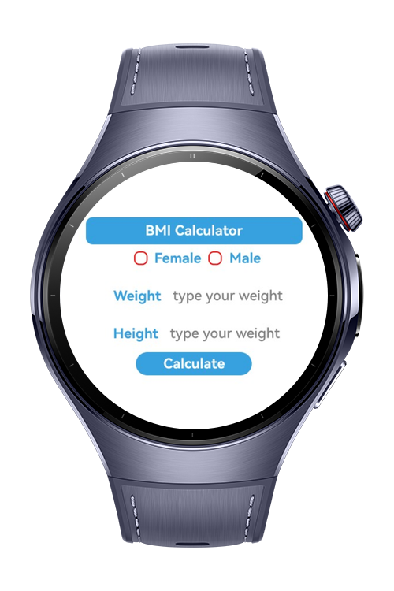
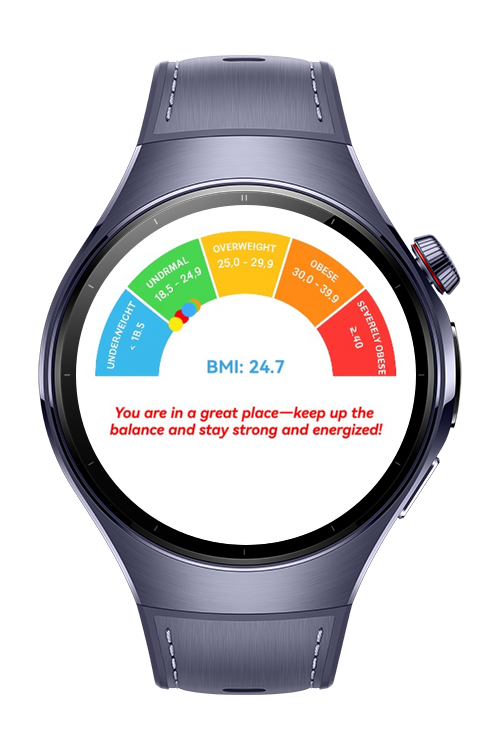

> **Note:** To access all shared projects, get information about environment setup, and view other guides, please visit [Explore-In-HMOS-Wearable Index](https://github.com/Explore-In-HMOS-Wearable/hmos-index).

# BMI Calculator

BMI Calculator is a practical health tool that allows users to calculate their Body Mass Index quickly and effortlessly. By entering height and weight, users can see which BMI category they fall into and gain a better understanding of their overall health. The app is designed with a clear, user-friendly interface, making it suitable for people of all ages. Whether you are focused on fitness goals, tracking lifestyle changes, or simply keeping an eye on your wellbeing, this app offers an easy way to stay informed and make healthier choices.

# Preview

<div>
   
   
   
</div>

# Use Cases

1. Personal Health Check: Users can quickly assess their body mass index to gain a snapshot of their current health status.

2. Lifestyle Support: People on a diet or exercise program can use the app to observe progress and adapt their routines accordingly.

3. Preventive Awareness: By identifying whether they are at risk due to being overweight or underweight, users can take early steps toward healthier living.

4. Motivation Tool: Regular tracking of BMI encourages users to stay consistent with their health and fitness goals.

5. Educational Aid: The app can be used in schools or health workshops to teach individuals about the importance of balanced body weight and wellness monitoring.

# Tech Stack

- **Languages**: ArkTS
- **Frameworks**: HarmonyOS SDK 5.0.0(12)
- **Tools**: DevEco Studio Vers 5.1.0.842
- **Libraries**: @kit.ArkUI

# Project Directory
   ```
   entry/src/main/ets/
    ├── components
    │ ├── CheckBox.ets          // CheckBox component and UI design
    │ ├── Header.ets            // Header's UI design file
    ├── pages
    │ ├── TabPage.ets           // It creates a new UI design using the height and weight values from the first page. It also displays the BMI value on the screen            
    │ ├── Index.ets             // Home Page
   ```

# Constraints and Restrictions
## Suported Devices
- Huawei Watch 5

# License
**BMICalculator** is distributed under the terms of the MIT License
See the [LICENSE](./LICENSE) for more information.