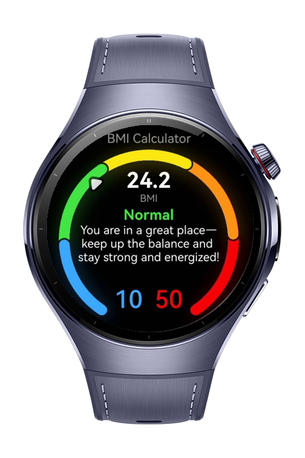
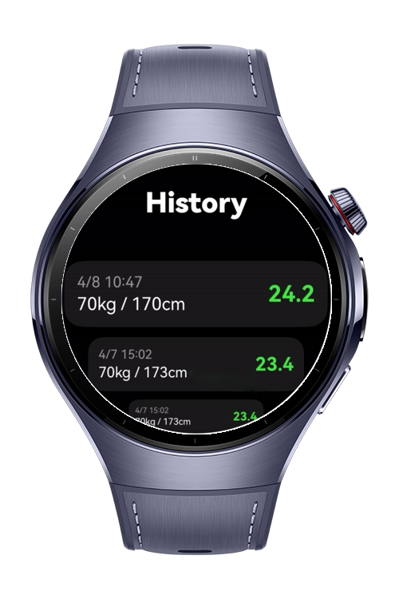

# BMI Calculator

BMI Calculator is a practical health tool that allows users to calculate their Body Mass Index quickly and effortlessly. By entering height and weight, users can see which BMI category they fall into and gain a better understanding of their overall health. The app also keeps a local history of past calculations, so users can track changes over time. Designed with a clear, user-friendly interface, it is suitable for people of all ages. Whether you are focused on fitness goals, tracking lifestyle changes, or simply keeping an eye on your wellbeing, this app offers an easy way to stay informed and make healthier choices.
# Preview

<div>
  
  
  
</div>

# Use Cases

1. Personal Health Check: Users can quickly assess their body mass index to gain a snapshot of their current health status.

2. Lifestyle Support: People on a diet or exercise program can use the app to observe progress and adapt their routines accordingly.

3. Preventive Awareness: By identifying whether they are at risk due to being overweight or underweight, users can take early steps toward healthier living.

4. Progress Tracking: The history page stores every past calculation with date, weight, height, and BMI value, letting users review their progress over time at a glance.

5. Motivation Tool: Regular tracking of BMI encourages users to stay consistent with their health and fitness goals.

6. Educational Aid: The app can be used in schools or health workshops to teach individuals about the importance of balanced body weight and wellness monitoring.

# Technology

## Stack
- **Languages**: ArkTS
- **Frameworks**: HarmonyOS SDK 5.0.0(12)
- **Tools**: DevEco Studio Vers 5.1.0.842
- **Libraries**: @kit.ArkUI, @kit.ArkData, @kit.SensorServiceKit, @kit.AbilityKit

## Required Permissions
* `"ohos.permission.VIBRATE"`

# Directory Structure
   ```
   entry/src/main/ets/
 ├── components
 │   ├── CheckBox.ets                 // Gender selection component
 │   ├── Header.ets                   // App header component
 │   ├── CustomValuePickerDialog.ets  // Reusable picker dialog for weight/height input
 ├── entryability
 │   ├── EntryAbility.ets             // Application entry ability
 ├── entrybackupability
 │   ├── EntryBackupAbility.ets       // Backup extension ability
 ├── pages
 │   ├── Index.ets                    // Home page with weight/height input and BMI calculation
 │   ├── TabPage.ets                  // BMI result page with gauge visualization and category display
 │   ├── HistoryPage.ets              // Past BMI records listed in an ArcList
 ├── utils
 │   ├── DBManager.ts                 // Singleton database manager using relationalStore
   ```

# Constraints and Restrictions
## Suported Devices
- Huawei Watch 5

# License
**BMICalculator** is distributed under the terms of the MIT License
See the [LICENSE](./LICENSE) for more information.